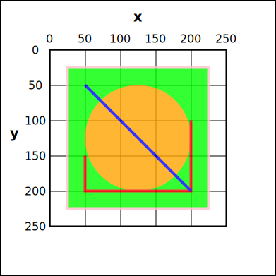

[#doc]
= My title: A subtitle
//:doctype: book
:toc: preamble
:notitle!:

include::src/abstract_text.adoc[]

include::src/chap1/main.adoc[leveloffset=+1]

include::src/chap2/lipsum.adoc[leveloffset=+1]

[#chap-more]
== More chapters

Has images!

[#img-svg]
.things

And *bold text*.
And _italics_.
Even `monospaced`!

And I can refer to my image (see <>).

<<<

== Another chapter

It's worth noting that I can refer to <<chap-more>> here too.
Or even the whole <<doc>>

.Block title things
====
Yep, that's right, it's a block title.
====

.Sidebar things
****
And a sidebar too!
****

|===
| column a | column b | column c

| whatever | whatever | whatever
| and so +
with line breaks
| on
| and so
| and it goes on
| and on
| and on
|===
.and here

[quote, mr magoo, things]
____
here is some text from a thing

and some linebreaks too
____

[verse, mr magoo, other things]
____
helloo
   this also has linebreaks
and
stuff
____

=== Whatever

As earlier described cite:[small] by citenp:[big]

=== Time to get weird

Can I do ^superscripts^?

Here we have some maths stem:[\sqrt{4} = 2] in the middle of a line.
And here, some more

[stem]
++++
\frac{1}{2}
++++

Here -> are => some -> arrows (TM)

††††

A circle has 360&#176;

[bibliography]
== References

bibliography::[]
